# Google Africa Developer Scholarship: GADS 2020
# Community Projects

# OVERVIEW
The world at large is changing and changing for the better in the tech ecosystem. The #COVID19 pandemic has changed how we approach our day to day activities giving technologists an opportunity to innovate

# EXPECTATIONS
GADS 2020 learners will be expected to come up with innovative solutions to solve for the current challenges that contribute to the future of day to day activities. The solutions will be around solving for challenges in the following sectors:
- EDUCATION
- HEALTH
- E-COMMERCE
- FINTECH
- REMOTE WORK

# CHALLENGE PROMPTS
Implementation of effective and practical solutions to ensure the delivery of quality education.
Strengthen the healthcare system and improve the lives of #COVID19 or non #COVID19 patients.
Develop solutions to promote e-commerce platforms and transition physical markets closer to the customers online.
Build solutions that address scalable digital payments to support cashless banking, cash transfers to support payment-related activities.
Ensuring the productivity of remote employees.

# My project :

- Individual Participation
- Project Category :  EDUCATION
# Project Name : Big Pen  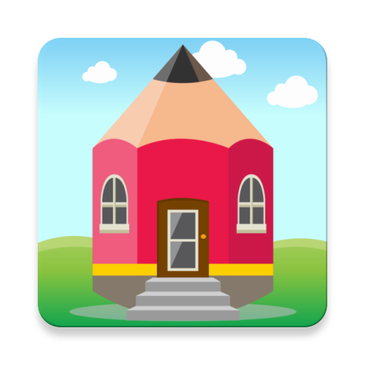
Most schools have remained closed due to the # COVID19 pandemic for most of 2020, which has led to staying home (Especially during the confinement period) our kids want to do activities like reading, writing and as we know, children (ages 3 to 8) each of them wants their own tools (pens, pencils of different colors, notebooks, books, ...) which is impossible in most case and if someone steals one tool from another then this war.
This app helps us well even for the non # COVID19 period.

# Supported Languages:
- English (default)
- French 
- Arabic 
- Hindi 
- Japan
- Standard_Chinese

# Video link:
https://youtu.be/F04W_1HzzXc

# APK link:
https://drive.google.com/file/d/1oqEUNaDQXh-27k3q2NQBAWQrmBJSEMsJ/view?usp=sharing

# This project will help you understand:

- Activity 
- Fragment 
- ActivityLifecycle 
- FragmentLifecycle 
- Custom Style 
- Material Design 
- UI/UX 
- Intent (Activity/Fragment) 
- CustomView with TouchEvent 
- Android sensor 
- Custom Toast 
- Custom ProgressDialog, AlertDialog 
- BroadcastReceiver 
- AlarmManager 
- Custom Notification 
- Custom FontFamily 
- Custom Adapter 
- Recyclerview 
- CardView 
- Adding Dependencies like: 
  - CircleImageView 
  - ClansFab 
  - BoomMenu 
  - FluidSlider 
  - CarouselView 
- Room section 
- SharedPreferences 
- Glide 
- Firebase database 
- Firebase auth 
- Firebase storage 
- Google ads: RewardedVideoAd, InterstitialAd 
- In-App Purchases 
- And more...

# Technologies:

# Prerequisites:

# Instructions:

To use and test the source code you must:
 - Enter your app id in the string file:
     - Your_app_ads_id
     - Your_app_video_ads_id
     - Your_app_interstitial_ads_id
     
 - Donloawd your fire base file config: google-services.json   
 
 # Screenshot:
- Welcome Screen:

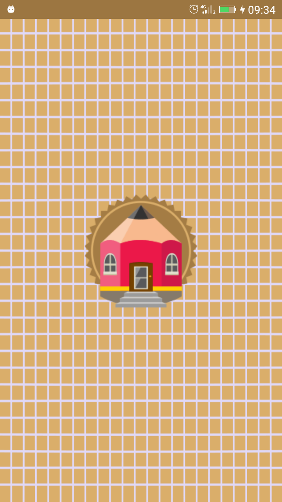 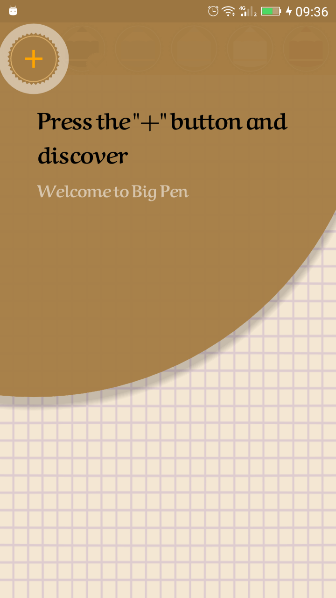

- Menus:

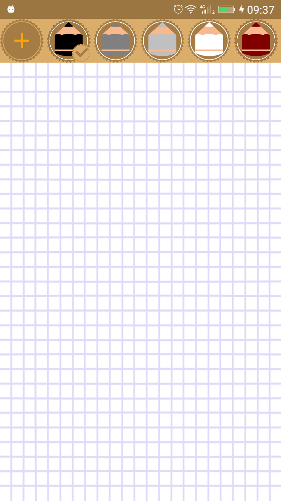 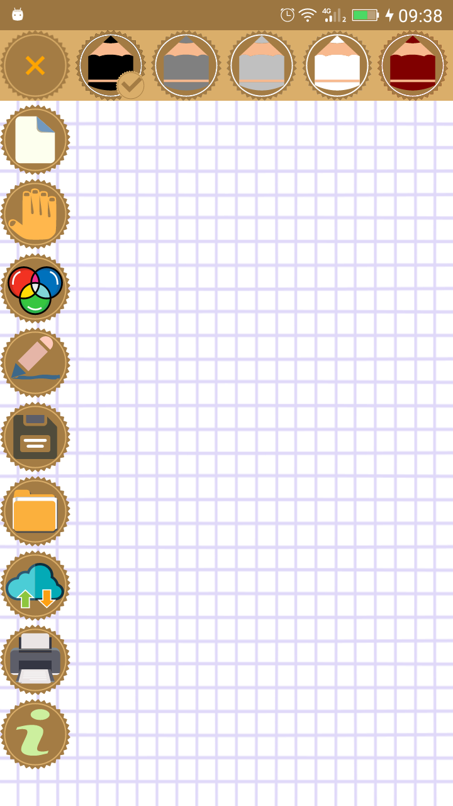

- Tools:

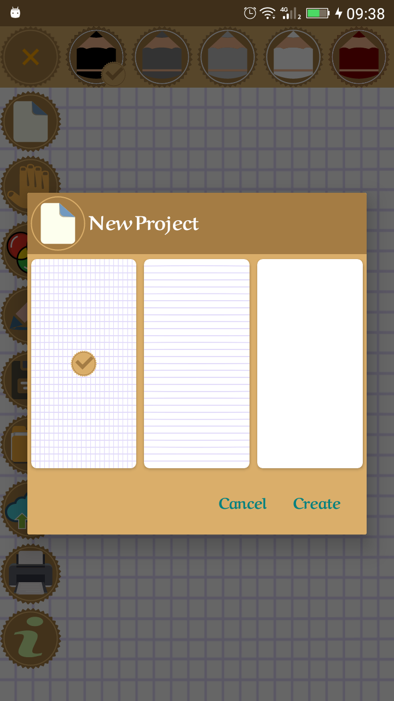 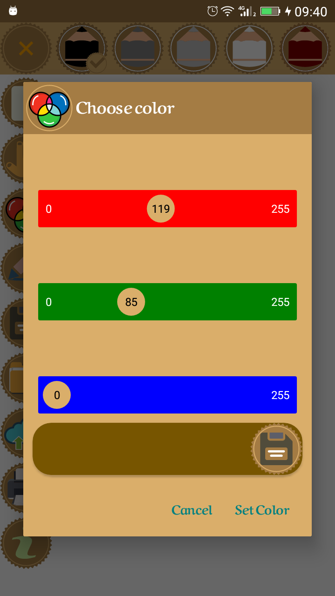
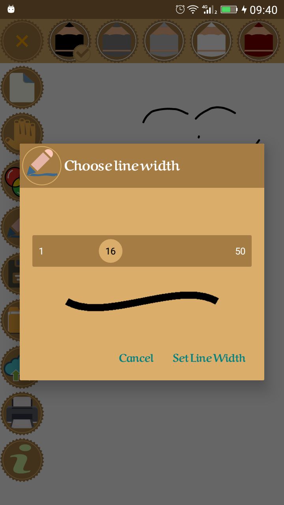

- Cloud Menus:

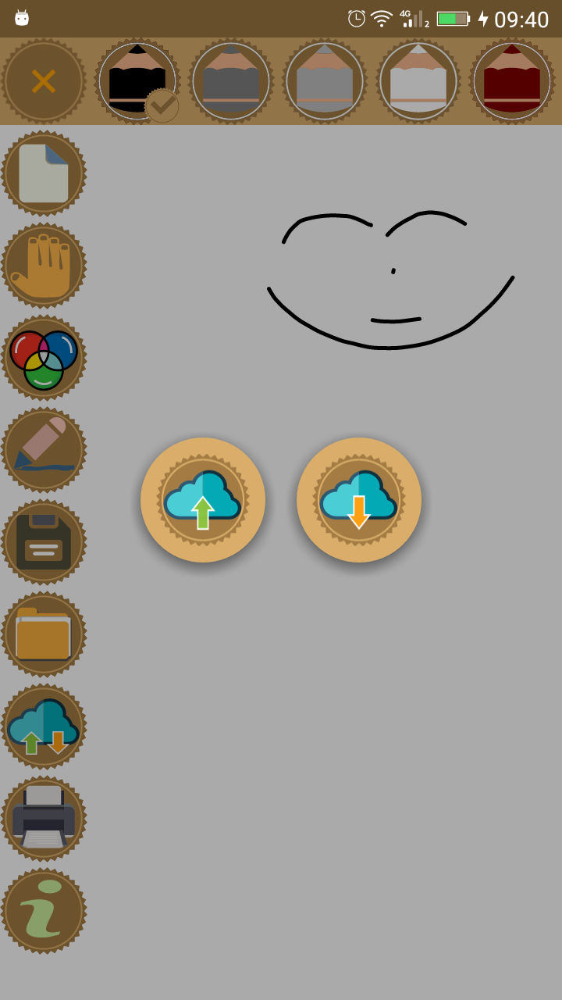

- Bookstores:

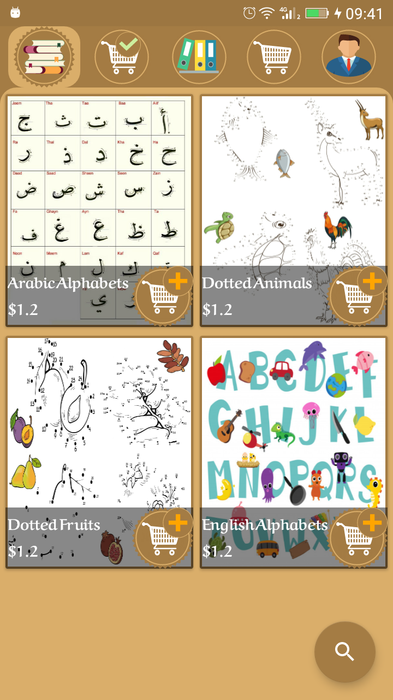 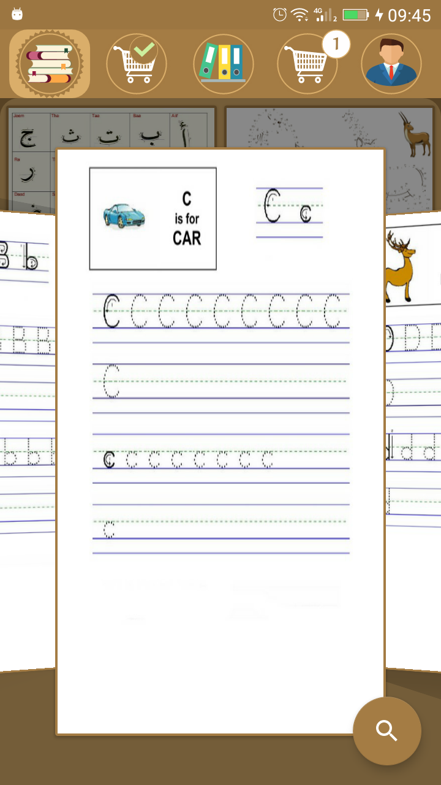

- Authentification:

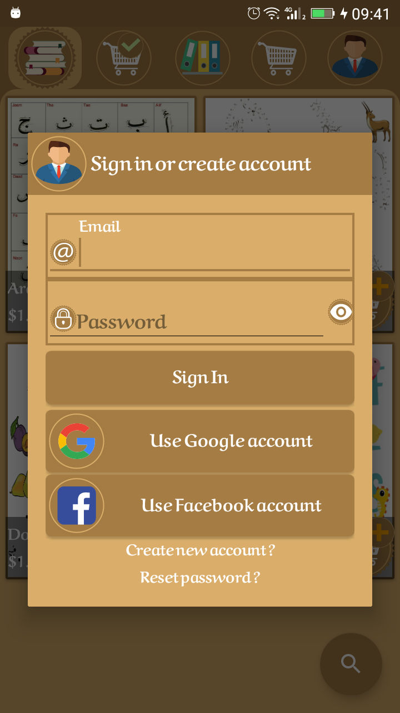

- User account:

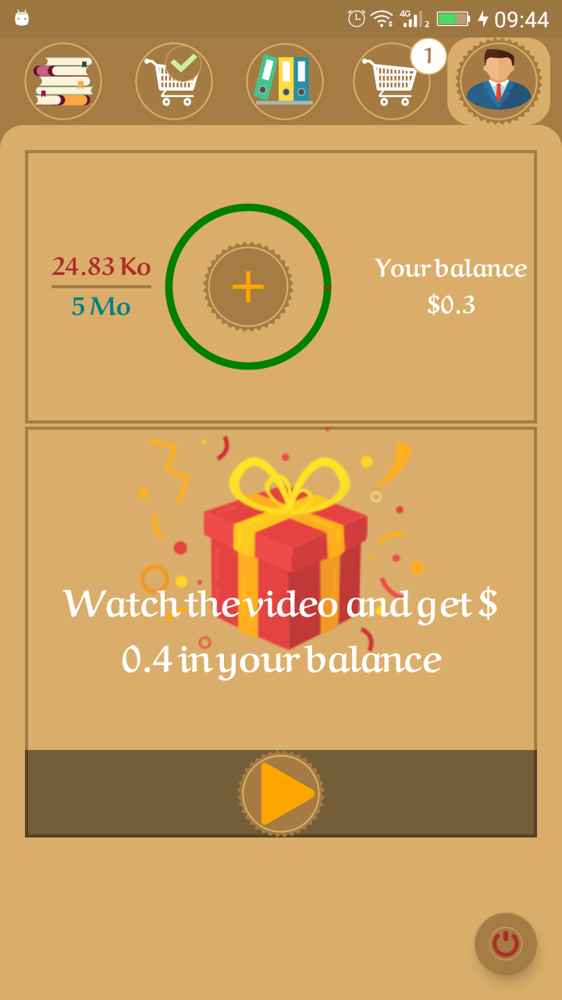

- User store:

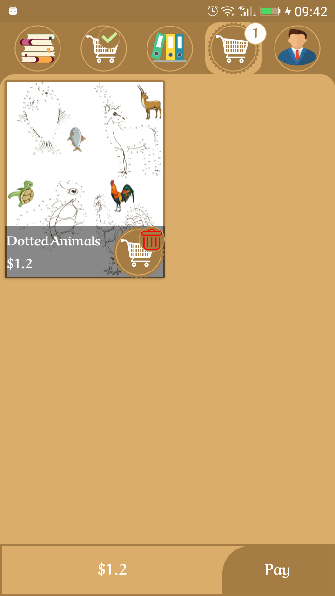 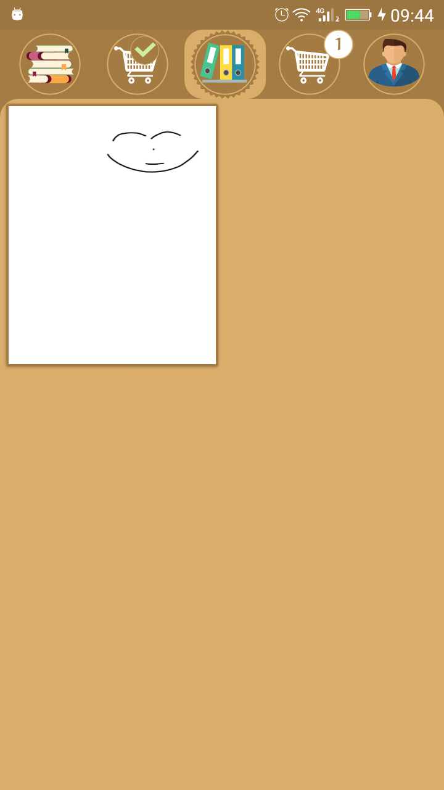

- Purchase options:

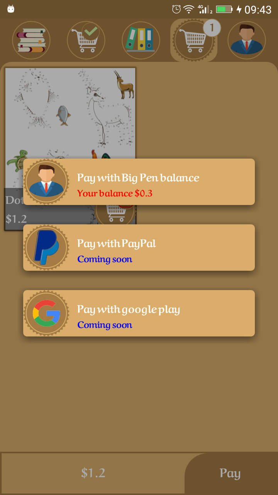

- Project from bookstore:

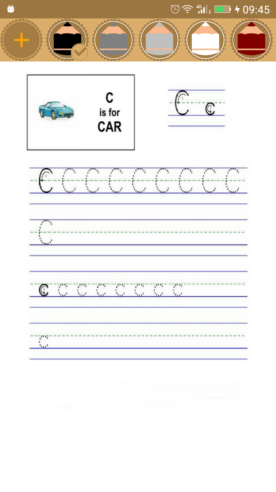

